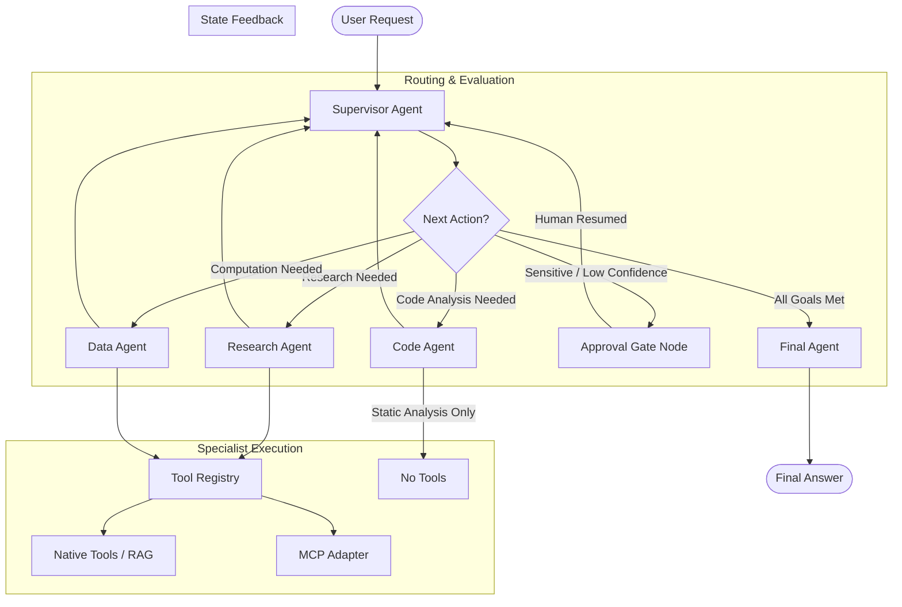
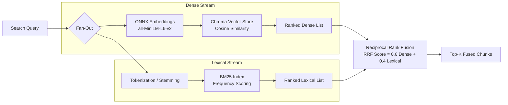
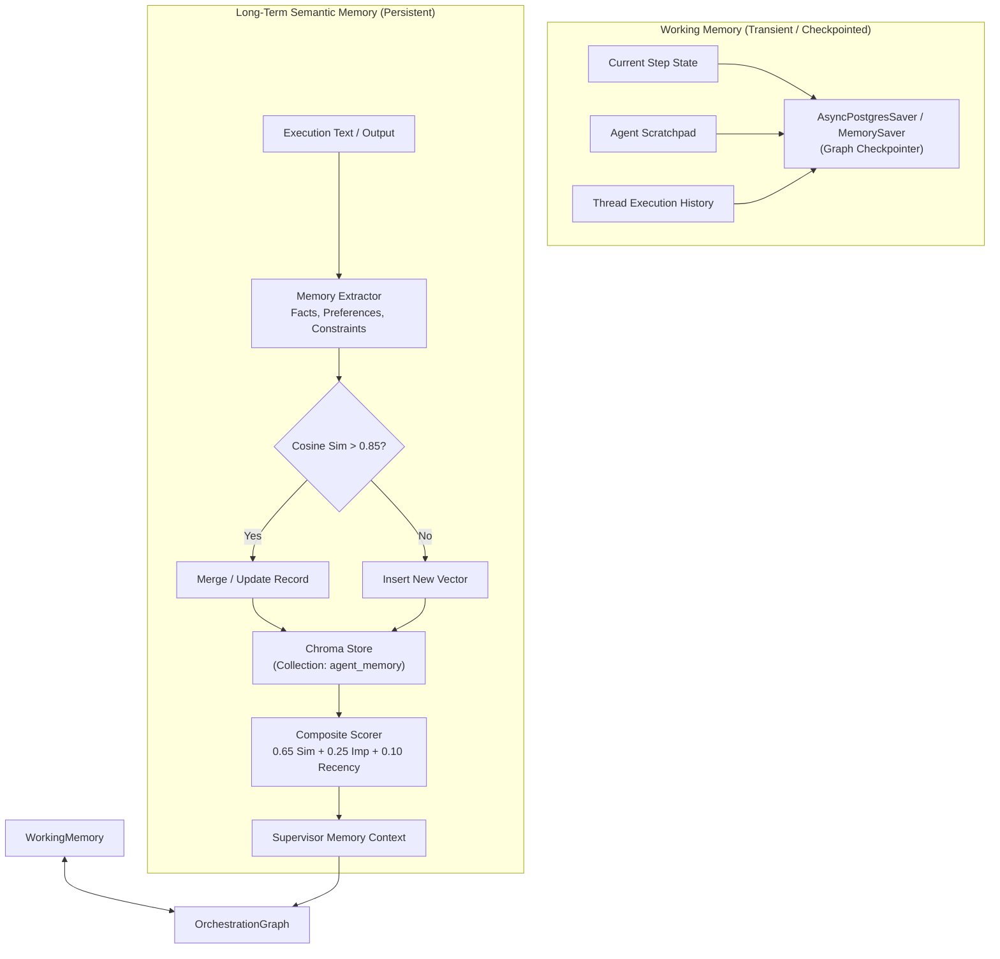
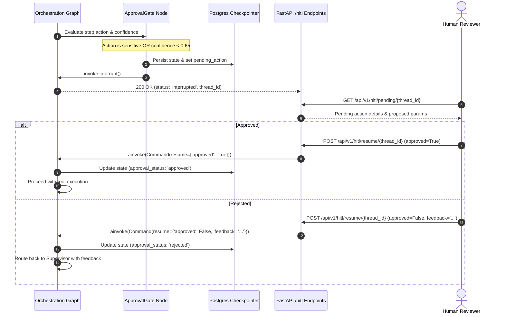
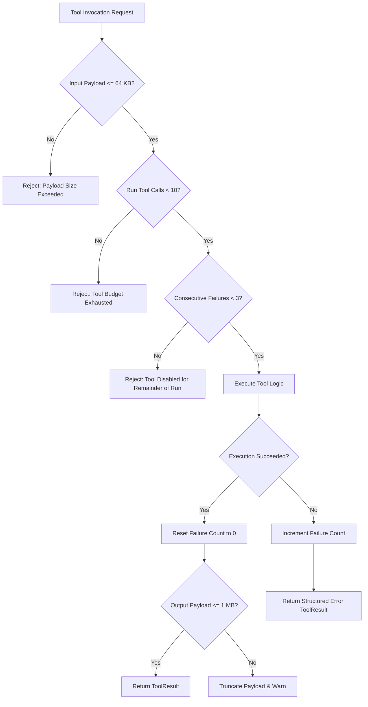
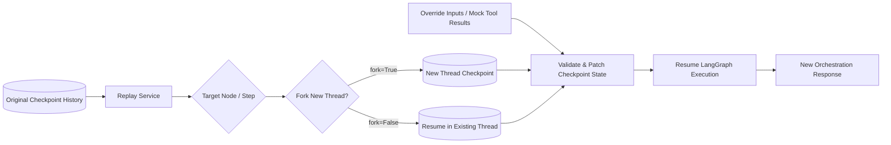

# Architecture Diagrams

This document collects architectural and sequence diagrams illustrating key platform subsystems.

---

## 1. Multi-Agent Orchestration Topology

---

## 2. Hybrid RAG Architecture (Dense + BM25 + RRF)

---

## 3. Dual-Tier Memory Architecture

---

## 4. Human-in-the-Loop (HITL) Interrupt & Resume Cycle

---

## 5. Tool Guardrail & Consecutive-Failure Disablement Workflow

---

## 6. Execution Replay & Fork Architecture

