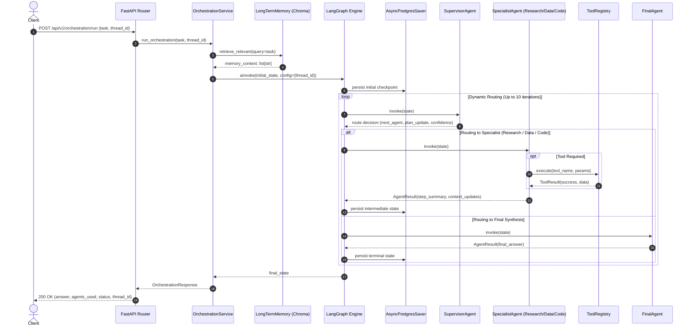

# Runtime Execution Flow

This document details the lifecycle of execution within the Multi-Agent AI Orchestration Platform, covering the primary multi-agent orchestration loop and all secondary operational branches.

---

## 1. Primary Orchestration Execution Flow

When a client submits an orchestration request via `POST /api/v1/orchestration/run`, the request progresses through the following sequential stages:

### Stage Breakdown

1. **Ingress & Validation**: The incoming payload is validated against `OrchestrationRequest`. A unique `thread_id` is assigned if not supplied by the client.
2. **Memory Context Injection**: `OrchestrationService` queries the long-term semantic memory store for facts, preferences, and relevant contextual records matching the task.
3. **Graph Initialization**: The `OrchestrationState` is instantiated containing the query, memory context, and empty history logs.
4. **Supervisor Reasoning Loop**:
   - The Supervisor evaluates the current task, accumulated history, and memory context.
   - It outputs a next agent destination, updated step plan, and routing confidence score ($0.0 \dots 1.0$).
5. **Specialist Execution & Guarded Tool Calls**:
   - The targeted specialist receives execution control.
   - If tools are required, calls flow through the guarded `ToolRegistry`.
   - Tool outputs are appended to the agent's scratchpad and returned in structured form.
6. **Checkpoint Persistence**: Each node transition persists an asynchronous state snapshot to PostgreSQL (or in-memory checkpointer).
7. **Synthesis & Response**: When all subtasks are resolved, the Supervisor routes to `FinalAgent`, which produces the aggregated answer and marks status as `completed`.

---

## 2. Alternate Execution Flows

### 2.1 Guarded Tool Execution
1. Specialist invokes `ToolRegistry.execute(name, arguments)`.
2. Input payload size is checked against `TOOL_MAX_PAYLOAD_SIZE_BYTES` (64 KB).
3. The global run budget counter is checked against `TOOL_MAX_CALLS_PER_RUN` (10).
4. The tool's consecutive failure counter is checked against `TOOL_MAX_FAILURES_BEFORE_DISABLE` (3).
5. Tool logic executes within an exception boundary.
6. If output exceeds `TOOL_MAX_OUTPUT_SIZE_BYTES` (1 MB), it is rejected or truncated.
7. Result is wrapped in `ToolResult` with status, duration, and error metadata.

### 2.2 Model Context Protocol (MCP) Tool Execution
1. Specialist requests an MCP tool (e.g., `mcp.local.calculator`).
2. `MCPToolAdapter` translates the standardized `BaseTool.arun()` call into an MCP Client JSON-RPC invocation over standard I/O.
3. The local MCP server validates tool name against its internal allowlist.
4. Server computes the tool result and returns an MCP Content object.
5. `MCPToolAdapter` unpacks text content and converts it back into `ToolResult`.

### 2.3 Hybrid RAG Retrieval Flow
1. Specialist invokes `knowledge_search` or an API client posts to `/api/v1/knowledge/search`.
2. The search query is routed in parallel to:
   - **Dense vector search**: Query is embedded via local ONNX model and compared against Chroma embeddings using cosine similarity.
   - **Lexical search**: Query is tokenized and scored against the BM25 index.
3. Raw result sets are merged using Reciprocal Rank Fusion:
   $$RRF(d) = \alpha \cdot \frac{1}{k + r_{\text{dense}}(d)} + (1 - \alpha) \cdot \frac{1}{k + r_{\text{lexical}}(d)}$$
4. Top-$K$ fused chunks are returned with similarity scores and document metadata.

### 2.4 Semantic Memory Retrieval & Consolidation
1. **Extraction**: Post-interaction, text is passed to `MemoryExtractor` which isolates discrete facts, user preferences, and project constraints.
2. **Deduplication**: Candidate memories are embedded and compared against existing vectors in Chroma. If cosine similarity exceeds $0.85$, the memory is merged or refreshed rather than duplicated.
3. **Retrieval**: Candidate memories are scored using composite weighting:
   $$\text{Score} = 0.65 \times \text{Similarity} + 0.25 \times \text{Importance} + 0.10 \times \text{Recency}$$
4. **Consolidation**: Background or periodic consolidation sweeps purge records exceeding their TTL and synthesize related memories.

### 2.5 Human Approval / Interruption Flow (HITL)
1. Supervisor routes to an action or agent step flagged as sensitive, or routing confidence is below $0.65$.
2. The `approval_gate` node intercepts execution before action invocation.
3. The gate executes LangGraph's native `interrupt()`, halting graph progression.
4. Current graph state, pending action details, and thread context are frozen in the checkpointer.
5. The API returns status `interrupted` to the client.
6. An operator calls `GET /api/v1/hitl/pending/{thread_id}` to inspect the frozen state.
7. Operator submits a decision via `POST /api/v1/hitl/resume/{thread_id}`:
   - **Approved**: Execution unpauses with `Command(resume={"approved": True})` and the specialist executes the action.
   - **Rejected**: Execution resumes with `Command(resume={"approved": False})`, routing to the supervisor with user feedback for replanning.

### 2.6 Replay / Fork Execution Flow
1. Client calls `POST /api/v1/orchestration/replay` supplying an existing `thread_id` and optional modifications (`target_node`, `override_inputs`, `fork=True`).
2. `ReplayService` loads the thread's checkpoint history from the checkpointer.
3. If `fork=True`, a new child `thread_id` is created, cloning history up to the target step.
4. If `mock_tool_results` are provided, they are validated against tool schema safety checks.
5. The graph resumes execution from the selected checkpoint node forward.

### 2.7 Tool Budget Exhaustion Flow
1. If agents invoke tools 10 times within a single orchestration run, the budget guard triggers.
2. Subsequent tool requests return `ToolResult(success=False, error="Tool execution budget exhausted (10 calls). Please synthesize answer with existing data.")`.
3. The specialist informs the Supervisor, which delegates directly to `FinalAgent` for best-effort synthesis.

### 2.8 Tool Failure Isolation Flow
1. When an external tool raises an unhandled exception (e.g. network timeout, host unresolvable, malformed expression):
2. The exception is trapped in `ToolRegistry.execute()`.
3. The tool's consecutive failure counter is incremented. If count reaches 3, the tool is marked disabled for the remainder of the thread.
4. A structured error is returned to the agent prompt: `{"success": false, "error": "...", "recoverable": true}`.
5. The agent observes the error and selects an alternative strategy or reports inability to fetch data.

### 2.9 Observability & Tracing Flow
1. Each incoming request creates an OpenTelemetry server span.
2. Spans are created hierarchically:
   - Root span: `api.orchestration.run`
   - Child span: `orchestration.step.<step_number>`
   - Child span: `agent.<agent_name>`
   - Leaf span: `tool.<tool_name>` or `llm.generate`
3. Token usage and latency are tracked on the span and recorded into in-memory system metrics.
