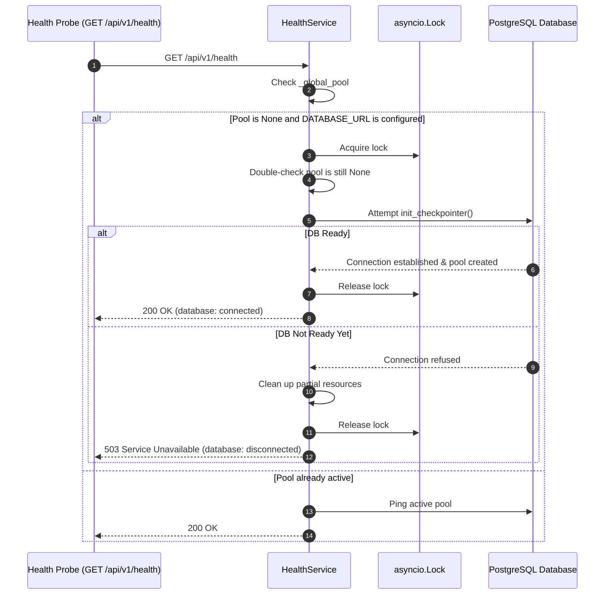

# Health, Liveness & Self-Healing Readiness

The platform provides dual-tier health monitoring designed to integrate seamlessly with container orchestrators (such as Docker Compose, Kubernetes, and ECS).

---

## 1. Liveness vs. Readiness Probes

| Probe | Endpoint | Purpose | Failure Consequence |
|---|---|---|---|
| **Liveness** | `GET /health` | Checks if the Python ASGI process is alive and processing HTTP events. | Orchestrator restarts the container process. |
| **Readiness** | `GET /api/v1/health` | Evaluates whether downstream dependencies (PostgreSQL checkpointer pool, Chroma vector store) are initialized and ready to serve traffic. | Orchestrator routes traffic away from this instance until healthy. |

---

## 2. Self-Healing PostgreSQL Readiness

In containerized environments, the application container frequently starts before the database container has finished its internal database creation and authentication initialization. A naive startup routine that fails permanently on the first connection failure forces unnecessary container crash-loops.

### Architectural Solution: Asynchronous Self-Healing
The platform implements an asynchronous, thread-safe, self-healing connection routine in `HealthService`:

### Key Guarantees
1. **Concurrency Protection**: Protected by an `asyncio.Lock` with double-checked locking, preventing multiple concurrent readiness probes from spawning redundant connection pools.
2. **Resource Cleanup**: Partial connection resources are cleanly closed on connection failure.
3. **Zero Restart Recovery**: Once PostgreSQL completes initialization, the subsequent readiness probe automatically succeeds, transitioning the service from `503 Service Unavailable` to `200 OK` without manual intervention or process restarts.

---

## 3. Subsystem Health Checks

`GET /api/v1/health` inspects:

1. **Database Checkpointer**:
   - `status: "connected"`: Active connection pool responding to queries.
   - `status: "in-memory"`: Operating with fallback `MemorySaver` (development mode).
   - `status: "disconnected"`: Database URL configured but connection could not be established.
2. **Vector Store**:
   - `status: "ready"`: Persistent Chroma directory exists and collection operations succeed.
   - `status: "unhealthy"`: Directory permission error or corrupted vector store.
3. **MCP Server**:
   - `status: "running"`: In-process reference MCP server is operational.
4. **LLM Provider**:
   - Reports the active provider (`mock`, `openrouter`, `gemini`, `groq`, `openai`).
